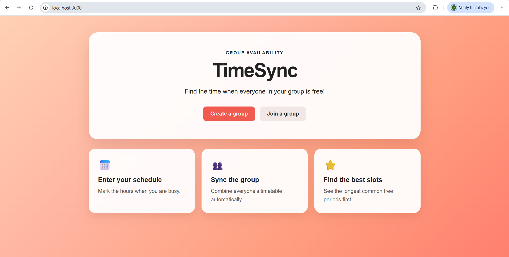
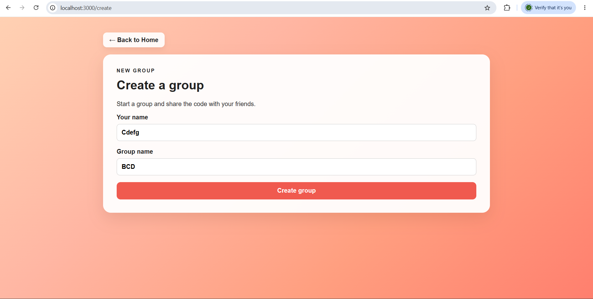
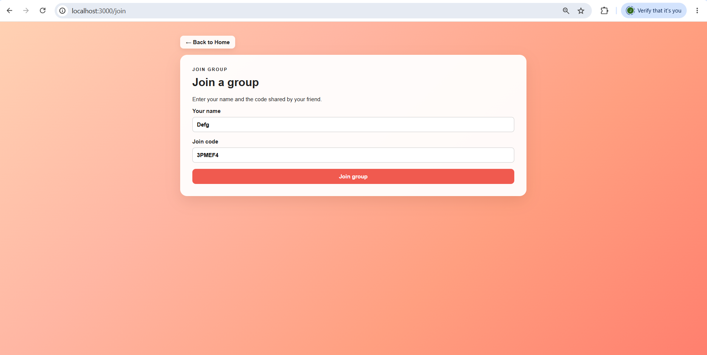
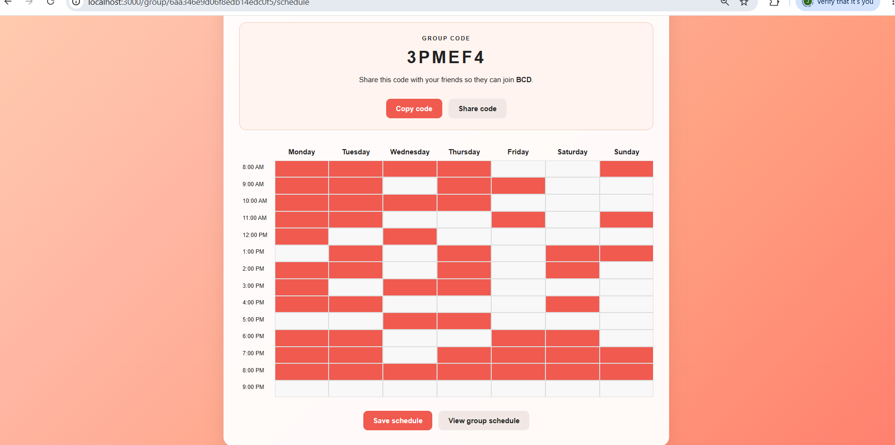
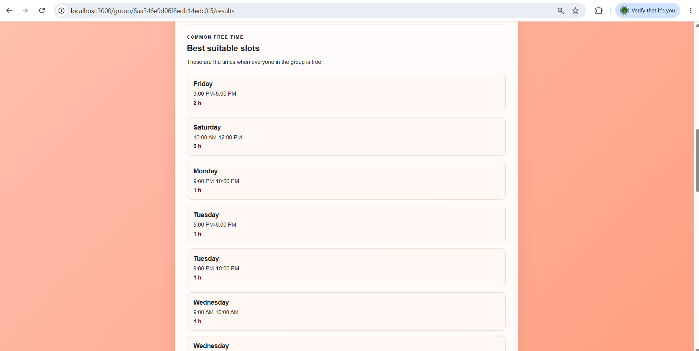

# TimeSync

### Find when everyone is free.

TimeSync is a group availability scheduler that helps friends and teammates find a common free time.

Each member enters their busy hours, and TimeSync automatically finds and ranks the common free slots.

---

## Features

- Create a group with a unique join code
- Join a group using the shared code
- Enter and save weekly busy schedules
- View each member's busy hours
- Find common free time automatically
- Rank free slots by duration
- Copy and share the group code
- MongoDB database for storing groups and schedules
- Public holiday information using Nager.Date API

---

## Tech Stack

- React
- Next.js
- React Router
- JavaScript
- TypeScript
- MongoDB
- Mongoose
- Nager.Date API
- CSS

---

## How It Works

### Create a Group

Enter your name and group name to create a group. TimeSync generates a unique join code.

### Join a Group

Friends can enter their name and the shared join code to join the group.

### Enter Your Schedule

Each member marks the hours when they are busy during the week and saves their schedule.

### Find Common Free Time

TimeSync combines everyone's busy schedules and finds the periods when all members are free.

The longest available slots are shown first.

---

## Screenshots

### Home Page



### Create Group



### Join Group



### Schedule



### Group Results



---

## Demo Video

[Watch the TimeSync Demo](YOUR_VIDEO_LINK)

---

## Database

TimeSync uses MongoDB with Mongoose.

### Groups

Stores:

- Group name
- Unique join code
- Group members

### Timetables

Stores:

- Group ID
- Member ID
- Member name
- Weekly busy slots

---

## Scheduling Logic

1. Collects the busy slots of all group members.
2. Groups the slots by day.
3. Merges overlapping busy intervals.
4. Finds the gaps between busy intervals.
5. Calculates the duration of each free slot.
6. Ranks the slots by duration.

---

## Running Locally

### Install dependencies

```bash
npm install